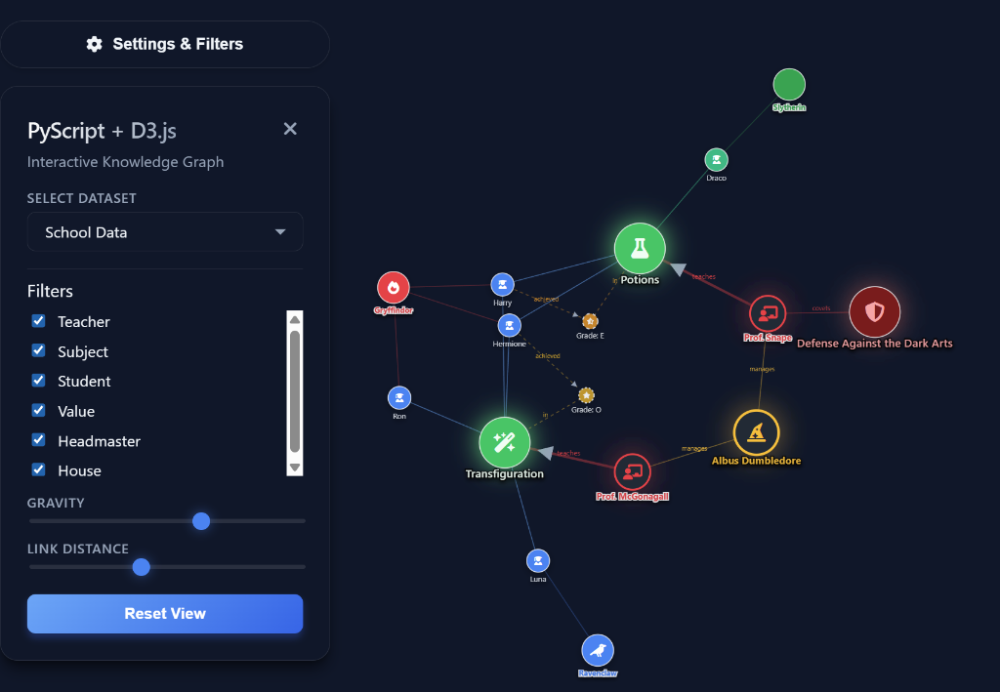

# 🕸️ PyScript D3 Network Visualizer

> **Visualize complex Python NetworkX graphs directly in your browser.**
> This is the public distribution build of the PyScript D3 Network Visualizer.

# NOTE

**VIBE CODED WITH AI** This project is the result of my first attempt to vibe code with AI. I used Gemini 3 Pro to generate the code and Antigravity to help me with the development process. It uses PyScript to run the python code in the browser and D3.js to create the visualization.

## Demo

The code includes a simple demo of a knowledge graph with nodes and edges, showing all possible styling options (colors, icons, halos, etc.).


[Live Demo](https://camaris.github.io/pyscript-d3-network-viz/)

---

## ✨ Features

- **🐍 Python-First**: Define graph logic in `examples.py` using `networkx`.
- **🎨 Premium UI**: Dark-mode, glassmorphism, and neon glow effects.
- **⚡ Interactive**: Physics controls, zoom/pan, and focus modes.
- **💎 Rich Styling**: FontAwesome icons, arrows, and custom node halos.
- **🚀 Serverless**: Runs entirely in the client browser via PyScript (WASM).

---

## 🚀 Usage

### 1. Clone & Run
Since this project uses PyScript, it must be served via a local web server to handle WASM CORS requirements.

```bash
git clone https://github.com/camaris/pyscript-d3-network-viz.git
cd pyscript-d3-network-viz
python -m http.server 8000
```
Open [http://localhost:8000](http://localhost:8000) in your browser.

### 2. Customizing Graphs (`examples.py`)
Modify `examples.py` to add your own data. The visualizer auto-detects functions returning a `networkx` graph.

```python
def get_my_graph():
    G = nx.DiGraph()
    G.add_node("Hello", extra_style={"color": "cyan", "glow": True})
    G.add_edge("Hello", "World", extra_style={"arrow": True})
    return G
```

---

## 🛠️ Configuration

| Feature | File | Description |
| :--- | :--- | :--- |
| **Logic** | `examples.py` | Add/Edit Graph Data Generators. |
| **Config** | `pyscript.json` | Python dependencies (NetworkX, etc). |
| **Style** | `style.css` | CSS themes and UI transitions. |

---

## 🔗 Development

This is the **Public Distribution** repository.
Active development happens in the private `pyscript-d3-network-viz-dev` repository.

If you are looking for the full source code history or want to contribute, please contact the maintainer.

---

## 📜 License
GNU Affero General Public License v3.0
